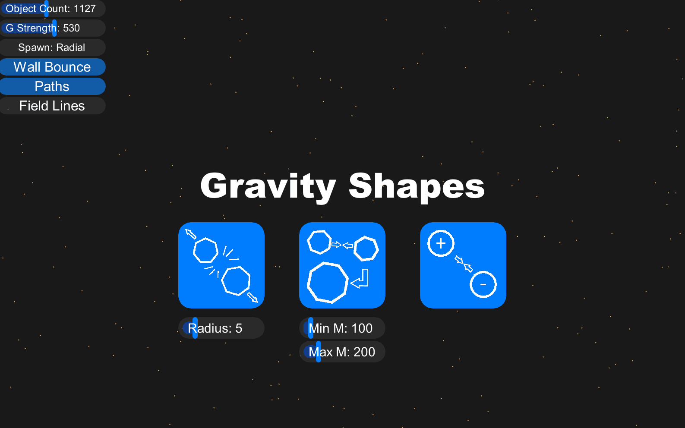
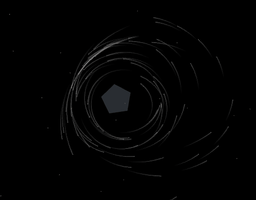
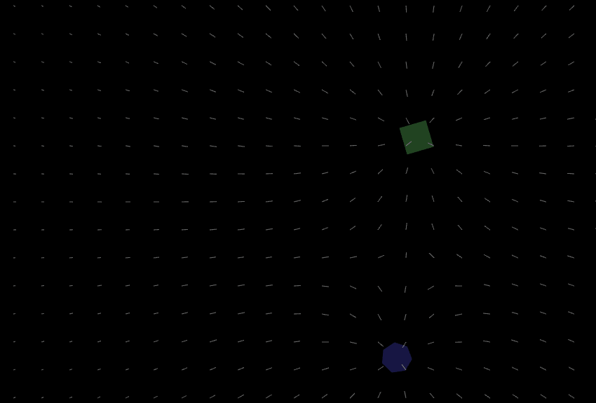
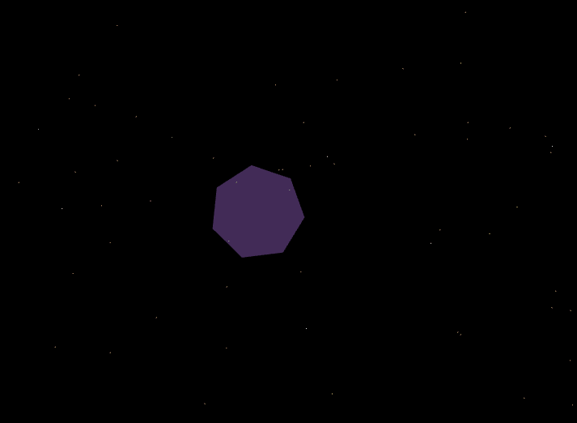
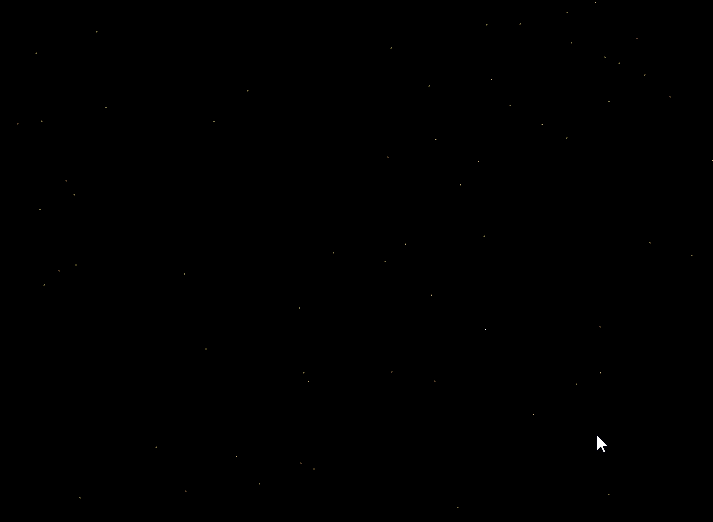
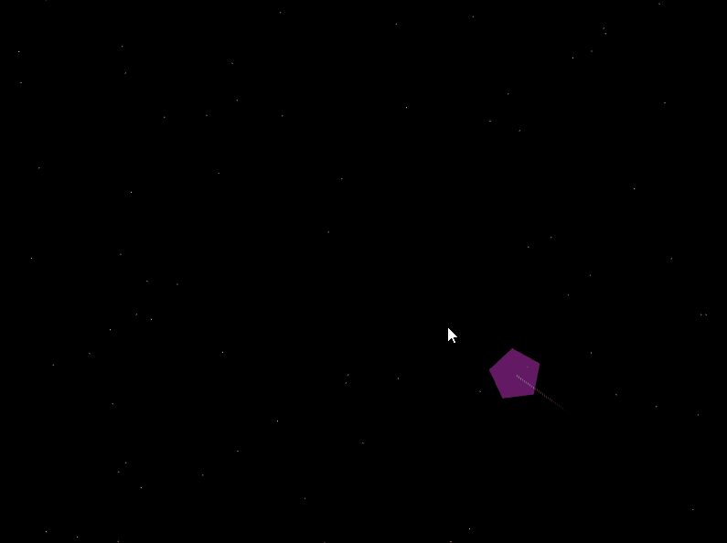
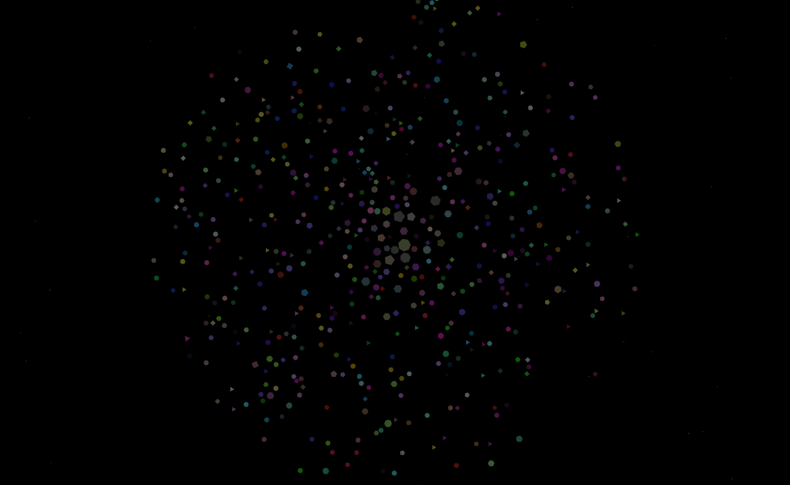
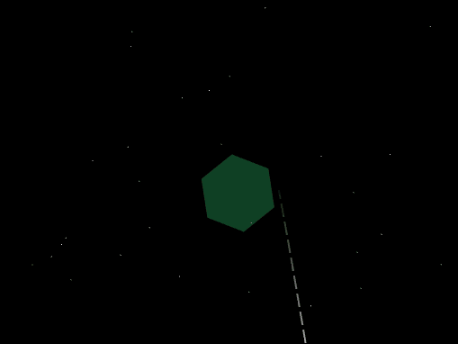
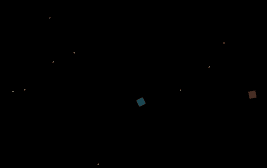

# GravityShapes

Gravity Shapes is a mini applet developed ing Java using my AppNexus library for UI creation.
This application created PhysicsObjects that orbit together with respect to Newtonian physics concepts such as:
- Kinematics
- Rotational Kinematics
- Forces/Torques
- Newton's Universal Law of Gravitation
- Conservation of Momentum
  
# Universal Options
Gravity Shapes has 6 main universal options users can toggle on and off

*Object Count*
- Determines the amount of naturally spawning objects on screen
  
*Gravity Strength*
- Determines the strength multiplier of the gravity equation. (The G constant)
  
*Spawn Patterns*
- Spawns objects randomly or radially (circular)
  
*Wall Bounce*
- Objects will bounce off of the walls with 90% restitution to keep all particles on screen
  
*Object Paths*
- Objects draw a path that fades to dark behind them
    
  
  
*Field Lines*
- Draws all gravitational field lines
    
  
  
# Object Shooter
Clicking on the screen and pulling back will activate the object shooter
The object shooter will draw a blue outline of the object that is about to be shot

*Simulated Particle Line*
- The shooter uses my SimulatedParticle object to calculate the kinematics equations for 50 steps forward. This will cause curves in the shoot line
  
  

*Rapid Shooting*
- Holding LShift while holding back the shooter will enable rapid fire mode. This will shoot a new object every tick
  
  

*Size Changing*
- By default, the shooter size will equal the minimum spawn size for the scene
- The shooter size can be changed by clicking UP or DOWN on the keyboard while pulling back

# Object Interactions

*Object Dragging*
- Objects can be dragged across the screen using the mouse.
- Dragging will remove all velocity that the object currently has

*Object Locking*
- Objects can be locked in place. When locked, and object will have no veloctiy and will be unable to be moved by other object, but can still be dragged
- The lock with toggle on and off with every right click. 
- The object will display a blue outline if locked.
  

# Merge Mode (Middle Button)
Merge Mode offers a template where objects combine when collided.

During the collision, particles become one where their polygons add their mass, average their vertices, and average their colors

Velocity after the collision is determined using perfectly inelastic conservation of momentum

  

*Rotational Motion*
- Objects in Merge Mode spin their polygons according to Rotational Motion.
- All objects have an accurate Rotational Inertia function set by the shape
- When objects collide, depending on their angle, they will apply a torque and spin the object
- The "Collision Time" for the torque is dependent on the step time of the particle
  

# Bounce Mode (Left Button)
THIS MODE IS NOT FINISHED
Objects bounce off of one another using Conservaton of Momentum

Velocity for both particles after the collision is determined using perfectly elastic conservation of momentum with a restitution value of 0.6

  

    
# Electronics Mode (Right Button)
  Unimplemented

